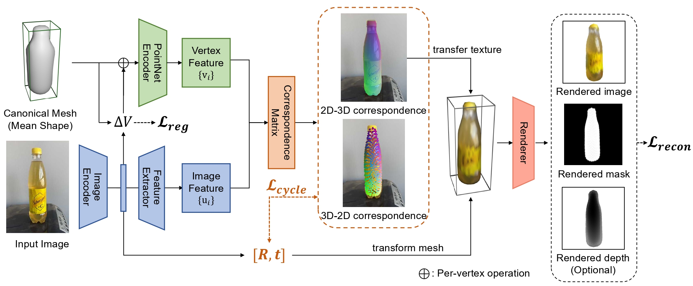

# Self-Supervised Geometric Correspondence for Category-Level 6D Object Pose Estimation in the Wild



This repository is the official implementation for the paper:

> Self-Supervised Geometric Correspondence for Category-Level 6D Object Pose Estimation in the Wild  
> [Kaifeng Zhang](https://kywind.github.io/), [Yang Fu](https://oasisyang.github.io/), [Shubhankar Borse](https://scholar.google.com/citations?user=ZsgWCyMAAAAJ&hl=en), [Hong Cai](https://scholar.google.com/citations?user=9y3Kd3cAAAAJ&hl=en), [Fatih Porikli](https://scholar.google.com/citations?user=VpB8NZ8AAAAJ&hl=en]), [Xiaolong Wang](https://xiaolonw.github.io)  
> ICLR, 2023  
> [Project Page](https://kywind.github.io/self-pose) / [ArXiv](https://arxiv.org/abs/2210.07199)  

## Progress

- [x] Training code
- [x] Evaluation code
- [x] Pretrained models
- [ ] More datasets

## Environment Setup

PyTorch with CUDA support are required. Our code is tested on python 3.8, torch 1.10.0, CUDA 11.1, and RTX 3090.

We recommend installing the required packages in the following order to avoid potential version conflicts:
```sh
pip install torch==1.10.0+cu111 torchvision==0.11.0+cu111 torchaudio==0.10.0 -f https://download.pytorch.org/whl/torch_stable.html
pip install absl-py tensorboard opencv-python setuptools==59.5.0 trimesh kornia fvcore iopath matplotlib wandb scikit-learn scipy
pip install --no-index --no-cache-dir pytorch3d -f https://dl.fbaipublicfiles.com/pytorch3d/packaging/wheels/py38_cu111_pyt1100/download.html
```
If the third step fails to find a valid version of pytorch3d, an alternative approach is to download the .tar.bz2 package from [the Anaconda website](https://anaconda.org/pytorch3d/pytorch3d/files?sort=length&sort_order=desc&page=1) (version: pytorch3d-0.6.1-py38_cu111_pyt1100.tar.bz2), and install the package with:
```sh
conda install /path/to/xxx.tar.bz2
```
Then, git clone our repository, and build the required [SoftRas](https://github.com/ShichenLiu/SoftRas) package located in ```PROJECT_ROOT/third-party/softras```:
```sh
cd third-party/softras
python setup.py install
```

## Data Preparation

To reproduce our experiments, please download the raw [Wild6D](https://github.com/OasisYang/Wild6D) dataset, unzip, and add dataset paths to training and testing configurations, for example, for the laptop training set, the correct path assignment is 
```sh
--dataset_path /path/to/wild6d/laptop/ --test_dataset_path /path/to/wild6d/test_set/laptop/
```

## Training
Our model uses a pretrained [DINO](https://github.com/facebookresearch/dino) for correspondence learning. Download the pretrained models from [here](https://drive.google.com/drive/folders/1MOeWKoHoBK9GH6jJ-BZPvD9rj9xQdWux?usp=share_link) and put them in the `PROJECT_ROOT/pretrain/` directory. Also create the ```PROJECT_ROOT/log/``` directory for logging. You can also assign custom paths via configuration.

Run training with ```train.py```. We have provided an example training script for the laptop category, run by the following command:
```sh
bash scripts/train.sh
```

## Testing
Run testing with ```predict.py```. We have provided an example testing script, run by the following, run by the following command:
```sh
bash scripts/predict.sh
```
The testing script also offers visualization options. For example, use ```--vis_pred --vis_bbox``` for bounding box visualization.

## Pretrained Models

We provide the pretrained models on Wild6D dataset containing all 5 categories. 

To use, download the checkpoints in this [link](https://drive.google.com/drive/folders/1m9JwibSun0GTHRcfHoVLBLmPc3DWqy0Q?usp=share_link). Indicate the checkpoint path with the ```--model_path``` argument in ```scripts/predict.sh```. 

## Citation

```bibtex
@article{zhang2022self,
  title={Self-Supervised Geometric Correspondence for Category-Level 6D Object Pose Estimation in the Wild},
  author={Zhang, Kaifeng and Fu, Yang and Borse, Shubhankar and Cai, Hong and Porikli, Fatih and Wang, Xiaolong},
  journal={arXiv preprint arXiv:2210.07199},
  year={2022}
}
```

## Acknowledgement

The skeleton of our code is borrowed from [ViSER](https://github.com/gengshan-y/viser-release/). Thank you for the great work.
Also thanks to the following external repos: [SoftRas](https://github.com/ShichenLiu/SoftRas), [Zero-Shot-Pose](https://github.com/applied-ai-lab/zero-shot-pose/), [U-CMR](https://github.com/shubham-goel/ucmr), [PerceptualSimilarity](https://github.com/richzhang/PerceptualSimilarity), [Objectron](https://github.com/google-research-datasets/Objectron).


